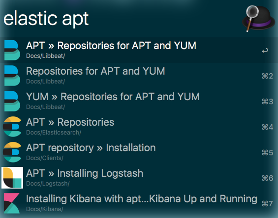

# Elasticsearch documentation alfred workflow

An alfred workflow, that queries the Elastic documentation and allows you to open the documentation in a browser directly from Alfred.

**Note**: You will need the Alfred [Powerpack](https://www.alfredapp.com/powerpack/) to use this workflow - which is commercial software. Check out the [Alfred app](https://www.alfredapp.com/) website.

**Note 2**: This is a rewrite of my earlier [elastic documentation
workflow](https://github.com/spinscale/alfred-workflow-elastic-docs) in
Crystal, mainly to reduce the maintenance overhead of updating security
relevant dependencies. This package does not have any production
dependencies, as everything can be done with the core language.

## Download

You can download the workflow from [the packal alfred workflow repository](http://www.packal.org/workflow/elastic-documentation-search), if you don't want to build it yourself.

## Usage

The keyword to trigger the search in Alfred is `elastic` by default.

You can search across the whole documentation, or you can limit by a product by using something like `elastic b beat`. These are the available product abbreviations:

| Letter | Product                              |
| ------ | ------------------------------------ |
| `b`    | libbeat                              |
| `mb`   | Metricbeat                           |
| `pb`   | Packetbeat                           |
| `wb`   | Winlogbeat                           |
| `fb`   | Filebeat                             |
| `jb`   | Journalbeat                          |
| `fb`   | Functionbeat                         |
| `e`    | Elasticsearch                        |
| `es`   | Elasticsearch                        |
| `l`    | Logstash                             |
| `ls`   | Logstash                             |
| `k`    | Kibana                               |
| `c`    | Cloud                                |
| `ece`  | Elastic Cloud Enterprise             |
| `i`    | Infrastructure                       |
| `cs`   | Clients                              |
| `sw`   | App Search/Site Search               |
| `a`    | APM                                  |
| `apm`  | APM                                  |

In addition when specifying a product, you can also specify a version like `elastic w 2.3 execute watch`

## Packaging

You need the `zip` binary installed. Run `make package` and you will end up with a `elastic.alfredworkflow` that you can open (doubleclick or call `open` on the command line) and import. Again, if you just want to use this workflow, download it from the packal repository linked above.

## Development

In order to run your tests, execute `crystal spec`.

## License

This is licensed under Apache2 license, because [open source...](https://www.flickr.com/photos/nez/8725092093)!

## Thanks

* [Colin](https://github.com/colings86) for testing, feedback, fixes and documentation improvements.
* [Sindre Sorhus](https://github.com/sindresorhus) for code improvements of the earlier node.js version

